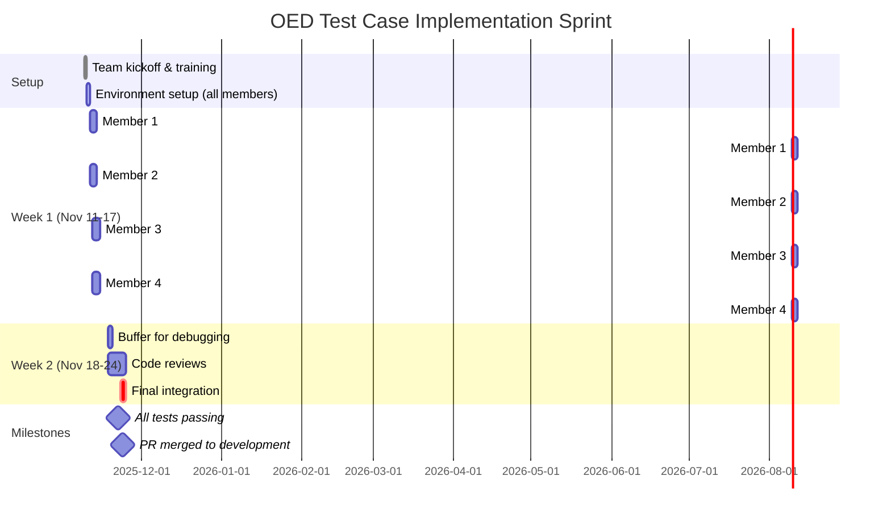

# OED Test Case Implementation - Project Timeline

## Team Members
- **Member 1**: [GitHub username]
- **Member 2**: [GitHub username]  
- **Member 3**: [GitHub username]
- **Member 4**: [GitHub username]

---

## Timeline (Week of Nov 11-17, 2025)



---

## Sprint Goals

### Week 1: Individual Test Implementation
**Goal**: Each member completes 2 test cases

- [ ] **Member 1**: L4, L21
- [ ] **Member 2**: L10, L23  
- [ ] **Member 3**: B8, B9
- [ ] **Member 4**: LG4, LG21

### Week 2: Review & Integration
**Goal**: All tests merged and passing

- [ ] Code reviews completed
- [ ] All CI checks passing
- [ ] Documentation updated
- [ ] Demo ready

---

## Progress Tracking

### Test Status Legend
- 🔵 Not Started
- 🟡 In Progress
- 🟢 Complete
- 🔴 Blocked

### Member 1 Progress
| Test ID | Status | Started | Completed | Blockers | PR Link |
|---------|--------|---------|-----------|----------|---------|
| L4      | 🔵     |         |           |          |         |
| L21     | 🔵     |         |           |          |         |

### Member 2 Progress
| Test ID | Status | Started | Completed | Blockers | PR Link |
|---------|--------|---------|-----------|----------|---------|
| L10     | 🔵     |         |           |          |         |
| L23     | 🔵     |         |           |          |         |

### Member 3 Progress
| Test ID | Status | Started | Completed | Blockers | PR Link |
|---------|--------|---------|-----------|----------|---------|
| B8      | 🔵     |         |           |          |         |
| B9      | 🔵     |         |           |          |         |

### Member 4 Progress
| Test ID | Status | Started | Completed | Blockers | PR Link |
|---------|--------|---------|-----------|----------|---------|
| LG4     | 🔵     |         |           |          |         |
| LG21    | 🔵     |         |           |          |         |

---

## Daily Standup Template

Post in Discord `#test-progress` channel:

```
📅 Daily Update - [Date]

👤 [Your Name]
✅ Yesterday: [What you completed]
🔨 Today: [What you're working on]
🚧 Blockers: [Any issues/questions]
```

---

## Team Metrics

| Metric | Target | Actual |
|--------|--------|--------|
| Tests Completed | 8 | 0 |
| PRs Merged | 8 | 0 |
| Tests Passing | 8 | 0 |
| Avg Time/Test | 3-4 hrs | TBD |
| Code Reviews | 16 | 0 |

---

## Risk Management

### Identified Risks
1. **Async schedules** → Mitigation: Clear handoff documentation
2. **Environment issues** → Mitigation: Setup day 1, help channel
3. **Blocked on reviews** → Mitigation: 24hr review turnaround goal
4. **Test failures** → Mitigation: Debug together in Discord call

### Escalation Path
1. Try to resolve individually (30 min)
2. Ask in Discord `#blockers` channel
3. Schedule pair programming session
4. Escalate to mentor/lead

---

## Meeting Schedule

### Weekly Sync (30 min)
- **Time**: [TBD based on team availability]
- **Agenda**: 
  - Review progress
  - Discuss blockers
  - Plan next sprint
  - Knowledge sharing

### Office Hours (Optional)
- **Time**: [TBD]
- **Purpose**: Open debugging session

---

## Resources

- [OED Test Documentation](link)
- [GitHub Issue #962](https://github.com/OpenEnergyDashboard/OED/issues/962)
- [Team Discord Server](link)
- [GitHub Project Board](link)

---

## Success Criteria

- [ ] All 8 test cases implemented
- [ ] All tests pass CI
- [ ] Code reviewed by at least 1 peer
- [ ] PRs merged to development branch
- [ ] Documentation updated
- [ ] Team retrospective completed

---

*Last Updated: 2025-11-09*
*Next Review: 2025-11-16*
